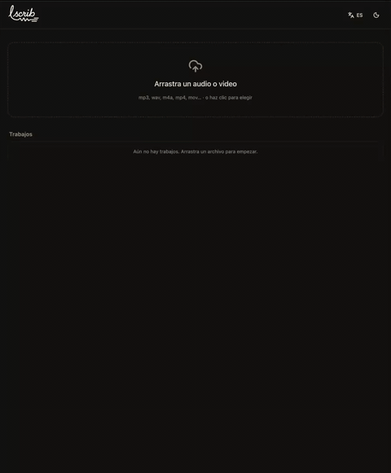

<div align="center">

<picture>
  <source media="(prefers-color-scheme: dark)" srcset="assets/logo-dark.png" />
  
</picture>

<br />

**Transcribe audio y video en tu propia máquina. Sin nube, sin cuenta, gratis.**

Arrastra un archivo y obtén un transcript editable con timestamps por palabra;
exporta a SRT, VTT, TXT o Markdown. Todo el cómputo ocurre en tu equipo.

`Python + FastAPI` · `faster-whisper` · `React 19` · `SQLite` · **un contenedor**


[Arrancar →](#arrancar-con-docker) · [Configuración](#configuración) · [Arquitectura](docs/ARCHITECTURE.md) · [Desarrollo](#desarrollo)

<br />



</div>

---

## Por qué lscrib

Whisper (el reconocedor de voz de OpenAI) es excelente, pero su experiencia no:
las herramientas de línea de comandos son inaccesibles, las apps con buena
interfaz son de pago y solo para Mac, y las webs "gratis" suben tu audio al
servidor de un tercero.

**lscrib es la cara que falta:** una app bonita, libre y multiplataforma que corre
Whisper **enteramente en tu máquina**. Tu audio nunca sale del equipo; la única
llamada a la red es la descarga puntual del modelo desde Hugging Face la primera vez.

La idea es simple: **móntalo en un minuto y tienes tu propia herramienta de
transcripción**, tuya y privada. Es mono-usuario a propósito —sin cuentas ni login—
para mantenerlo fiel al principio local-first; login, multi-usuario, diarización y
demás son extensiones naturales que la comunidad puede añadir encima (ver
[Arquitectura](docs/ARCHITECTURE.md) y [CONTRIBUTING](CONTRIBUTING.md)).

## Características

- Arrastrar y soltar cualquier audio o video (mp3, wav, m4a, mp4, mov… normalizado con ffmpeg).
- Detección automática de idioma (99+ idiomas) con opción de forzarlo.
- Selector de modelo (tiny → large-v3) con su compromiso de velocidad, calidad y peso.
- Progreso en vivo vía SSE: el transcript aparece a medida que se escribe.
- Transcript editable con timestamps por palabra; clic en una palabra y el audio salta ahí.
- Palabras de baja confianza resaltadas y vocabulario propio (nombres, jerga) para acertar.
- Exporta a SRT, VTT, TXT y Markdown.
- Cola por lotes: encola varios archivos, reordénalos y cancélalos.
- Modo oscuro, interfaz en español e inglés, atajos de teclado, accesibilidad WCAG AA.

## Arrancar con Docker

Requiere [Docker](https://docs.docker.com/get-docker/) con Compose.

```bash
git clone https://github.com/Yelt-dev/lscrib.git
cd lscrib
docker compose up -d
```

Abre **http://localhost:8000**. La primera vez descarga el modelo Whisper elegido
(desde Hugging Face); a partir de ahí, todo es local. Los audios y la base de datos
viven en volúmenes (`lscrib-data`, `lscrib-models`) y **nunca salen de tu máquina**.

El `docker-compose.yml` usa la imagen publicada `ghcr.io/yelt-dev/lscrib:latest`
(multi-arch: amd64 + arm64). Para compilar desde el código en su lugar, descomenta
`build: .` en el compose y arranca con `docker compose up -d --build`.

## Actualizar

Tus datos viven en el volumen `lscrib-data`, **independiente de la imagen**, así que
actualizar **no toca tus datos**: las migraciones de esquema se aplican solas al
arrancar. Para pasar a la última versión:

```bash
docker compose pull && docker compose up -d
```

Para fijar una versión concreta en vez de seguir `:latest`, cambia el tag en el
compose (p. ej. `ghcr.io/yelt-dev/lscrib:0.1`).

## Configuración

Todo se ajusta por variables de entorno (prefijo `LSCRIB_`). Los valores por defecto
funcionan sin tocar nada; en el contenedor ya vienen fijados los de red y rutas.

| Variable | Por defecto | Para qué |
| --- | --- | --- |
| `LSCRIB_PORT` | `8000` | puerto de escucha |
| `LSCRIB_DATA_DIR` | `/data` | medios normalizados subidos |
| `LSCRIB_DB_PATH` | `/data/lscrib.db` | base SQLite (metadatos) |
| `LSCRIB_MAX_FILE_MB` | `2048` | tamaño máximo por archivo |
| `LSCRIB_DEFAULT_MODEL` | `small` | modelo Whisper por defecto (`tiny` → `large-v3`) |
| `LSCRIB_DEFAULT_LANGUAGE` | `auto` | idioma por defecto (`auto` = detectar) |
| `LSCRIB_COMPUTE_TYPE` | `auto` | precisión de cómputo (CPU/GPU; degrada con claridad) |

La caché de modelos se guarda en `/models` (variable `HF_HOME`), montada como volumen
para no volver a descargar.

## Desarrollo

Requiere [uv](https://docs.astral.sh/uv/), Node.js y ffmpeg
(`brew install ffmpeg` / `apt install ffmpeg`).

```bash
# backend  -> http://127.0.0.1:8000
cd lscrib-api && uv run lscrib

# frontend -> http://localhost:5173   (en otra terminal, con recarga en caliente)
cd lscrib-web && npm install && npm run dev
```

El frontend (Vite) hace proxy de `/api` al backend. En producción FastAPI sirve el
build de React desde el mismo origen (un solo contenedor). Ver
[CONTRIBUTING.md](CONTRIBUTING.md) para el flujo de ramas, commits y releases.

## Arquitectura

El diseño, las decisiones técnicas y los trade-offs están en
**[docs/ARCHITECTURE.md](docs/ARCHITECTURE.md)**: pipeline de transcripción, worker en
proceso, progreso por SSE, persistencia en SQLite, migraciones y por qué se eligió cada
pieza (faster-whisper, sin Celery/Redis, un solo contenedor).

## Licencia

[MIT](LICENSE) © Yeltsin López
